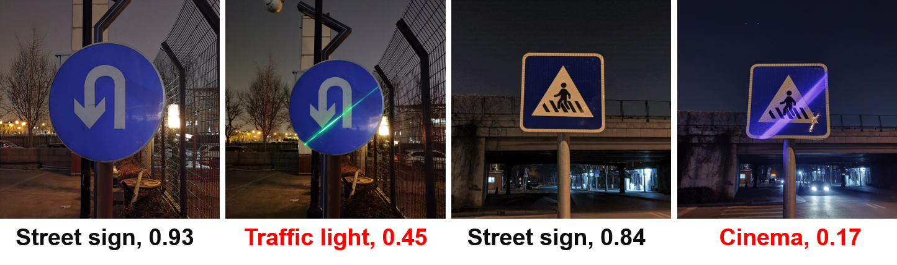
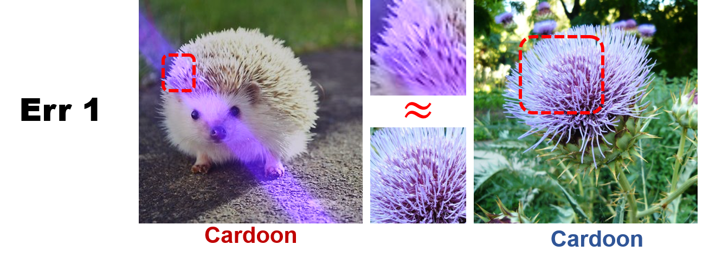
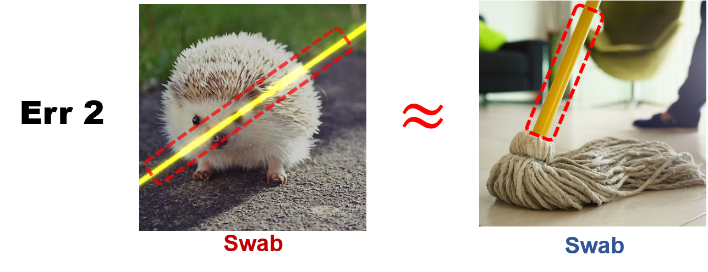

# AdvLB
Code and model for "Adversarial Laser Beam: Effective Physical-World Attack to DNNs in a Blink" (CVPR 2021)
<p align='center'>
  
</p>

(All will be done before April 25th, hopefully.)
## Introduction
Natural phenomena may play the role of adversarial attackers, e.g., a blinding glare results in a fatal crash of a Tesla self-driving car.
What if a beam of light can adversarially attack a DNN? Further, how about using a beam of light, specifically the laser beam, as the weapon to perform attacks.
In this work, we show a simple and cool attack by simply using a laser beam.  
To this end, we propose a novel attack method called Adversarial Laser Beam (AdvLB), which enables manipulation of laser beam's physical parameters to perform adversarial attack.
## Install& Requirements
#### Dependencies
* CUDA VERSION 10.2
#### Create environment
```sh
conda env create -f environment.yaml
conda activate advlb_env
```
#### Code
```sh
git clone https://github.com/RjDuan/AdvLB/
cd AdvLB-main
```
## Basic Usage
#### Attack
```sh
python test.py --model resnet50 --dataset your_dataset
```
#### Defense
Besides revealing the potential threats of AdvLB, in this work, we also analyze the reason of error caused by AdvLB and try to suggest an effective defense for laser beam attack. 
<p align='center'>
  
   
</p>
Similar to adversarial training, we progressively improve the robustness by injecting the laser beam as perturbations into the data for training. The details about training can be referred to the paper.

<center>
Models | Std. Acc. rate(%) | Attack Succ. rate(%)
------------ | ------------- | -------------
ResNet50(org) | 78.19 | 95.10
ResNet50(adv trained) | 78.40 |77.20
<\center>

The weights of "adv trained" ResNet50 model can be downloaded [here](https://drive.google.com/file/d/1HtwnsCFqKkoJoSSHo23BP90_ZCAVD_L7/view?usp=sharing).
```sh
python test.py --model df_resnet50 --dataset your_dataset
```
## Physical setting

## Limiations
* Slow
* Discuss limited pattern of light
* Limited in the daytime
## Q&A
Questions are welcome via ranjieduan@gmail.com
## Acknowlegement
* The defense part is completed by Xiaofeng Mao. 
## Cite


